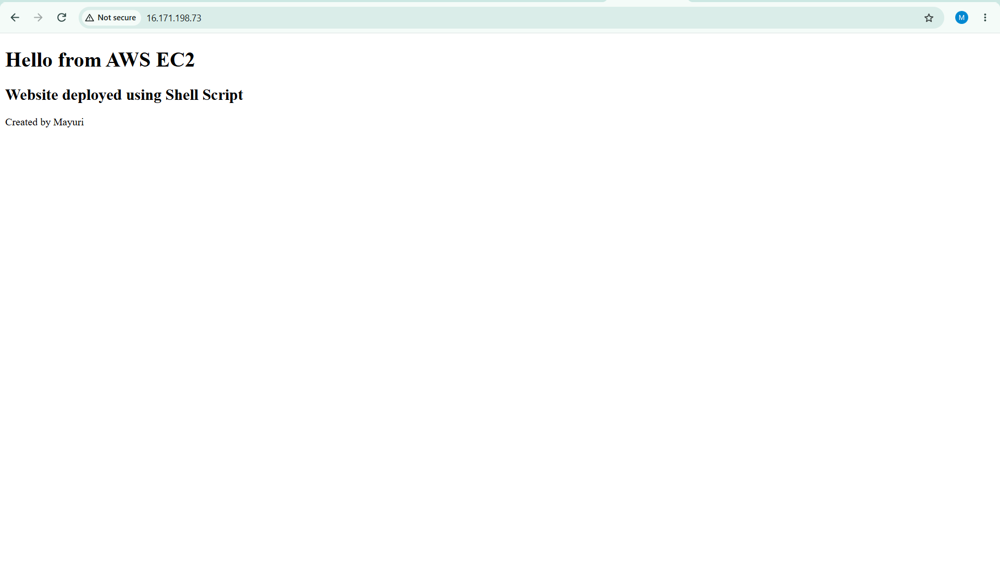
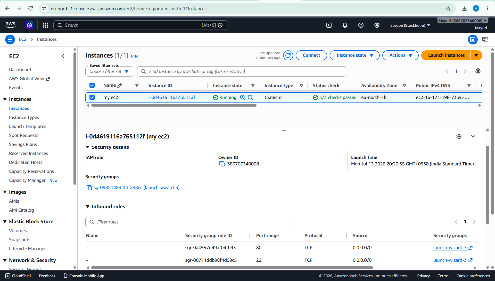
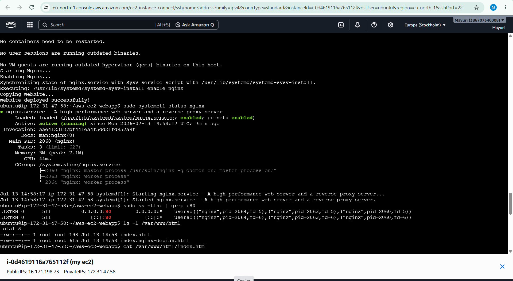
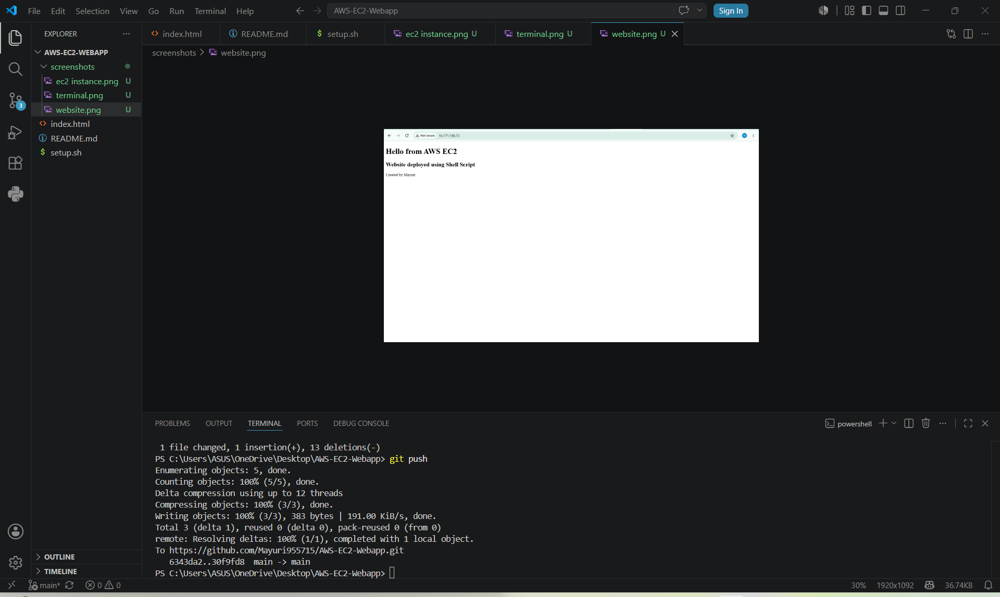

# AWS EC2 Web Application Deployment

## Project Overview

This project demonstrates how to deploy a static HTML website on an AWS EC2 Ubuntu instance using the Nginx web server. The deployment is automated using a Bash shell script.

## Technologies Used

- AWS EC2
- Ubuntu Linux
- Nginx
- Bash Shell Scripting
- Git
- GitHub
- Visual Studio Code

---

## Project Structure

```
AWS-EC2-Webapp/
│
├── index.html
├── setup.sh
├── README.md
└── screenshots/
    ├── website.png
    ├── terminal.png
    ├── ec2-instance.png
    └── vscode.png
```

---

## Automation

The `setup.sh` script performs the following tasks automatically:

- Updates Ubuntu packages
- Installs Nginx
- Starts the Nginx service
- Enables Nginx to start automatically after reboot
- Copies the website to the Nginx web directory

---

## How to Deploy

### Clone the repository

```bash
git clone https://github.com/Mayuri955715/AWS-EC2-Webapp.git
```

### Go to the project directory

```bash
cd AWS-EC2-Webapp
```

### Give execute permission

```bash
chmod +x setup.sh
```

### Run the script

```bash
./setup.sh
```

---

## Screenshots

### Website



### EC2 Instance



### Terminal



### VS Code



---

## Skills Learned

- Launching an AWS EC2 instance
- Connecting to EC2 using SSH
- Installing and configuring Nginx
- Deploying a static website
- Writing Bash shell scripts
- Automating server setup
- Using Git and GitHub
- Managing a GitHub repository

---

## Future Improvements

- Deploy using EC2 User Data
- Add GitHub Actions CI/CD
- Use Docker for containerization
- Configure a custom domain
- Add HTTPS using Let's Encrypt

---

## Author

**Mayuri**